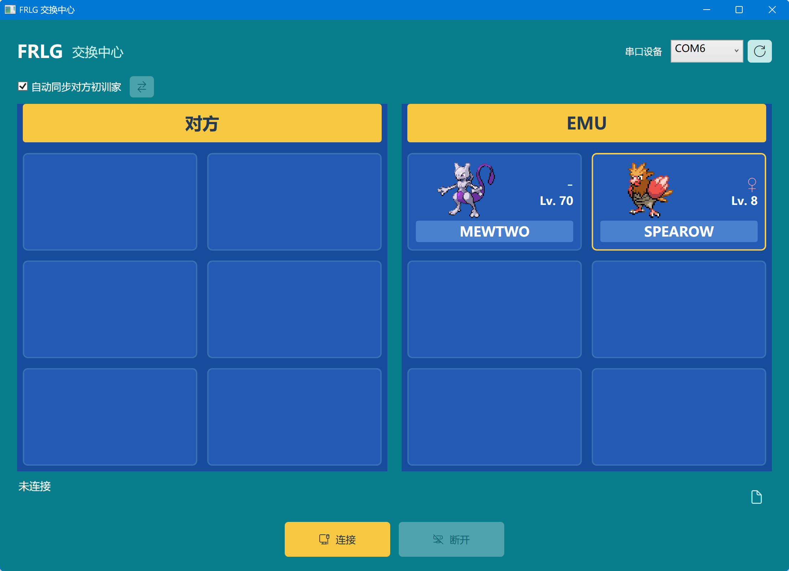
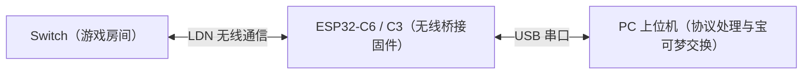

# FRLG 交换中心

本项目基于 [tornadus/frlg-ldn-trade](https://github.com/tornadus/frlg-ldn-trade) 移植，
提供 Windows C# 图形上位机与 ESP32-C6、ESP32-C3 无线桥接固件，两个芯片分别维护独立工程。



https://github.com/user-attachments/assets/484677c5-2db5-4e83-a864-ac67cbc7ce3b

C# 直接通过串口完成设备识别、房间扫描、LDN 认证、Pia/RFU 通信和交易；
PKHeX.Core 负责 PK3 展示与编辑。固件负责无线关联、会话密钥安装和数据收发。
房间配置和宝可梦数据在连接时通过串口下发。
电脑必须在连接期间持续运行上位机。



## 目录

| 目录 | 内容 |
| --- | --- |
| `host/core` | 纯 C# LDN、串口协议、Pia、RFU、交易状态机 |
| `host/desktop` | C# WPF 界面、PKHeX 编辑、队伍与设置保存 |
| `host/tests` | .NET 协议测试、离线回放、实板诊断入口 |
| `firmware/esp32-c6` | [ESP32-C6 固件](firmware/esp32-c6/README.md)，使用 UART，含 C6 专用构建和审计工具 |
| `firmware/esp32-c3` | [ESP32-C3 独立实验固件](firmware/esp32-c3/README.md)，使用原生 USB Serial/JTAG |
| `firmware/esp32-s3` | [ESP32-S3 独立实验固件](firmware/esp32-s3/README.md)，以 C3 为蓝本，使用 UART0，已实板验证完整交易 |
| `firmware/tools` | 两种芯片共用的 SDK 安装、环境激活与 Windows 无线诊断工具 |
| `assets/party` | 默认 MEWTWO、DEOXYS；程序不修改这些资源 |
| `assets/sprites` | 本地宝可梦 PNG 图片，1–386 |
| `app` | win-x64、依赖框架的单文件 EXE |
| `local` | 待用队伍、设置、会话日志和接收的 PK3，不应公开 |

## 运行与密钥

运行 `app/Frlg.Trade.Desktop.exe`，需要 Windows x64 版 .NET 10 Desktop Runtime。
默认宝可梦和全部图片已内置，只需复制 EXE 即可运行，无需附带 `assets` 或 `project.json`。
队伍、设置和会话日志保存在 EXE 同目录的 `local/`，请放在可写目录。
端口可以在界面选择。

`prod.keys` 在每次连接时读取，查找顺序固定：

1. EXE 所在目录，即本项目的 `app/prod.keys`。
2. 当前用户目录下的 `.switch/prod.keys`。
3. 都没有时弹出提示，要求放在程序目录；可打开该目录并重试。

优先位置存在但格式无效时，显示错误，不静默使用另一个文件。
密钥不加入资源、不复制到发布目录、不写入固件。固件仅接收本轮派生的 CCMP 密钥并保存在 RAM。

Switch 创建 FireRed Leader 房间后点击连接；进入房间、选择和确认交易仍在 Switch 上操作。
兼容性由串口协议版本和能力决定，设备型号仅在提示信息中显示。
其他单片机需要实现协议所要求的 LDN 无线能力，普通串口本身不足以连接 Switch。

左右各 3 行 2 列。左侧未连接时为空，收到完整有效队伍后显示，断开后清空。
右侧首次运行提供两只默认宝可梦，之后恢复保存的待用队伍；可拖入 80/100 字节 PK3、
点击空槽导入、选择提供对象，右键查看、导出或清空。黄色边框表示提供槽位。
本轮队伍至少包含两只；每次连接完成一笔交易，再由 Switch 取消、离房。

连接过程中可取消。串口异常、无线超时或后台任务结束都会恢复连接按钮并清空左侧。
主动断开立即终止本轮通信，不会在交易过程中自动重连；正常结束请在 Switch 上取消和离房。

## 初训家与队伍快照

勾选“自动同步对方初训家”或点击同步按钮，按 TID、SID、名称、性别去重。
只有一种身份时直接应用；多种时由用户选择，取消不修改。
覆盖右侧全部非空槽的这四个字段并重算校验，不修改 PID、个体值等其他字段。
无法用目标 PK3 语言表示的名字会使整批修改失败，保留原队伍。
改变 TID/SID 可能改变第三世代闪光判定；此功能不是合法性修复。

连接开始时建立本轮快照。连接中的导入、提供对象选择和初训家同步仅修改待用队伍，
标记“下次连接生效”，不会替换本轮已经发给对方的数据。
待用队伍保存到 `local/party.json`。每笔接收结果在提交时先保存到
`local/runs/<时间戳>-native/received.pk3`，然后通知界面；有待用修改时不会用结果覆盖待用槽。

## 构建与烧写

上位机只需要 .NET 10 SDK 和 NuGet 网络访问：

```powershell
.\setup.ps1
```

脚本与 Visual Studio 的 `FolderProfile` 使用同一发布配置：Release、win-x64、
依赖框架（不附带 .NET 运行时）、单文件，输出为 `app/Frlg.Trade.Desktop.exe`，不另附 DLL 或 PDB。

使用以下脚本构建与烧写固件需要完整 ESP-IDF 工具链。
安装 [EIM](https://github.com/espressif/idf-im-cli)（`winget install Espressif.EIM-CLI`）
后运行 `firmware/tools/setup.ps1`，脚本默认通过国内镜像（Espressif CDN、gh-proxy、
清华 PyPI）安装 C6、C3 所需工具链：SDK 位于 `%USERPROFILE%\esp\v6.1\esp-idf`，
工具链与 Python 环境位于 `C:\Espressif\tools`；`-UseGitHub` 切换回官方源。

固件固定使用 **ESP-IDF v6.1，提交 `fff9895c82d744c7237be8847347bdd1b07c6643`**。
两种芯片的 LDN 桥接均使用私有 WPA 回调表与密钥安装接口。
C6 工程还包含软件 CCMP 原始帧发送适配，以及发送诊断使用的驱动描述符和 DMA 结构偏移。
这些私有 ABI、符号和内存布局不保证跨 SDK 版本兼容，因此不能直接更换 SDK。

环境激活脚本会校验 SDK 提交；开启私有 raw TX 时，
还会校验 C6 的 `libnet80211.a` 和 `libpp.a`。发送适配从厂商库提取对象文件，
通过修改 ELF 符号表生成独立 overlay，将部分调用接入自定义实现；
不会修改已安装的 SDK，并会检查所用发送和帧校验代码段的机器指令字节保持不变。
升级 ESP-IDF 时，需要重新核对私有接口、回调表布局、库符号和结构偏移，
通过链接审计、空口抓包与实板入网及完整交易验证后，再更新版本和哈希限制。

ESP32-C6：

```powershell
.\firmware\esp32-c6\tools\probe.ps1 -Action build
.\firmware\esp32-c6\tools\probe.ps1 -Action flash -Port COM6
```

该脚本默认是 C6、UART、16MB、动态串口固件。烧写前关闭上位机连接和其他串口监视器。
完整交易桥接使用 `-Mode serial`。
串口号替换为实际设备端口，Flash 容量可用 `-FlashSize 4MB`、`8MB` 或 `16MB` 指定。
串口桥接通过板载 USB 转串口或外接 3.3V USB 串口适配器连接电脑：

外接时交叉连接 TX/RX 并共地；C6 的原生 USB Serial/JTAG 接口仅用于诊断配置，不能代替该工程的 UART 桥接。

`public`、`discovery`、`send` 保留作无线诊断，不提供完整交易桥接。

ESP32-C3：

```powershell
.\firmware\esp32-c3\tools\probe.ps1 -Action build
.\firmware\esp32-c3\tools\probe.ps1 -Action flash -Port COM5
```

C3 默认 4 MB Flash，通过原生 USB Serial/JTAG 连接电脑，详情见 [C3 工程说明](firmware/esp32-c3/README.md)。
两种芯片的构建产物分别保存在各自工程的 `build*` 目录内。

## 验证与移植

```powershell
dotnet run --project host/tests/Frlg.Trade.Tests.csproj -c Release
.\app\Frlg.Trade.Desktop.exe --smoke-test
# 需关闭 GUI 连接，以下检查会清理设备会话
dotnet run --project host/tests/Frlg.Trade.Tests.csproj -c Release -- --device COM6
```

协议测试使用随源码附带的合成密钥向量。私有交易回放存在时额外执行，
不存在时明确报告跳过。
WPF 自检会在 EXE 同目录生成 `local/ui-checks` 渲染图，测试结束后恢复真实队伍与设置。

C6 已完成两笔真实交易，并验证可连接新建的不同信道房间；C3 已完成实际进房及一次完整交易验证。
第三方设备实现请参考 [串口通信协议](docs/SERIAL_PROTOCOL.md)。

## 许可与数据

项目许可见根目录 `LICENSE`（AGPL-3.0）；LDN 协议组件的 GPL-3.0 许可见
`licenses/LDN-GPL-3.0.txt`。PKHeX.Core 固定为 26.8.26，
依赖由 `packages.lock.json` 锁定。图片来源见 `assets/README.md`。
默认 PK3 来自用户提供的数据；分享前按需移除。`local`、`prod.keys` 与构建产物均忽略提交。
