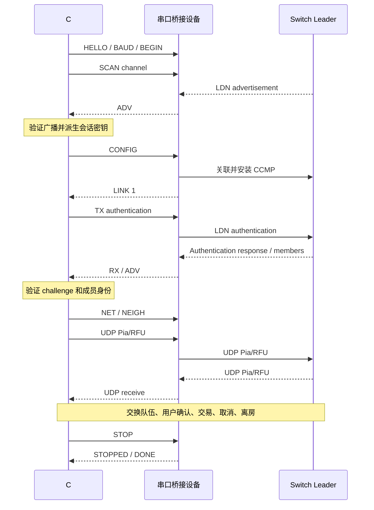

# FRLG Serial Bridge Protocol v1

本规范定义 C# 上位机与无线桥接设备之间的协议。设备型号不参与兼容性判断。
版本 1 的参考实现位于 `firmware/main/ldn_wire.c`、`ldn_control.c`、`ldn_udp.c`；
上位机实现位于 `host/core/SerialProtocol.cs`、`TradeSession.cs`。

## 职责与移植要求

上位机持有 prod.keys，解密和验证广播，派生本次会话密钥，执行 LDN 认证、Pia、RFU 和交易状态机。
设备接收本次房间的派生 CCMP 密钥，处理 802.11 关联、密钥安装和网络收发。
设备不解析 PK3，也不持有 prod.keys。更换宝可梦或房间不需要更新固件。

其他设备需要实现以下能力，而不只是提供串口：

- 监听指定信道的 Nintendo LDN vendor action 广播，原样上报加密内容及发送方 BSSID。
- 与房间关联，支持 LDN 使用的 RSN/CCMP 路径，安装 pairwise/group 会话密钥。
- 收发以太类型 0x88B7 的 LDN 认证帧。
- 配置 169.254.x.x/24 静态地址、邻居映射及 UDP 12345，最大 UDP payload 1472 字节。
- 正确处理 CCMP 重放保护、关联重建、断开通知和会话清理。

参考 C6 适配使用固定 ESP-IDF v6.1 私有接口。其他芯片可以使用自身驱动实现相同能力；
无需复制 C6 的私有 ABI、硬件跟踪、烧写命令或复位引脚操作。

## 串口与握手

8 数据位、无校验、1 停止位，无硬件流控。上电默认 115200 baud，运行时使用 921600。
打开串口时不主动切换 DTR/RTS，不要求芯片专用的复位序列。

设备刚启动时可能有普通启动日志。上位机发送 ASCII `\nLDN_BINARY\n`，再发送一个 0x00，
使设备进入二进制模式并让接收器找到帧边界。之后发送二进制 `LDN_HELLO` 命令。
已处于二进制模式的设备会丢弃前面的无效启动文本，并处理后续有效帧。
上位机可依次尝试 115200、921600，以重新打开上次未恢复波特率的设备。

HELLO 响应示例：`LDN_HELLO 1 esp32c6 dynamic-session,scan,auth,udp 1472`。
字段依次为版本、型号、逗号分隔能力、MTU。型号仅用于展示和诊断。
上位机应校验版本和所需能力；不能向旧固件下发动态配置后假定成功。

## 帧结构

每个原始帧先进行 COBS 编码，再附加一个 0x00 分隔符。COBS 编码区内不含 0x00。
接收器必须支持一次读到半帧、多帧、噪声及超长帧；错误后丢弃到下一个 0x00 重新同步。

| 原始帧偏移 | 长度 | 内容 |
| --- | --- | --- |
| 0 | 1 | 协议版本，固定 1 |
| 1 | 1 | 消息类型 |
| 2 | 4 | request_id，小端 |
| 6 | 4 | session_id，小端 |
| 10 | 2 | payload 长度，小端 |
| 12 | N | payload |
| 12+N | 4 | CRC-32/ISO-HDLC，小端 |

CRC 覆盖前 12+N 字节；反射多项式 0xEDB88320，初值和最终异或均为 0xFFFFFFFF。
原始帧最大 4096 字节，payload 最大 4080 字节。校验、长度或版本不匹配的帧不得执行。
参考固件的 ASCII 命令上限为 3015 字节；版本 1 命令表中的命令均应保持在此范围内。
COBS 是定界编码，CRC 是传输错误检测，二者都不是加密或身份认证。

| 类型 | 方向 | payload |
| --- | --- | --- |
| 1 | 上位机→设备 | ASCII 控制命令，无 NUL、CR、LF |
| 2 | 设备→上位机 | 请求响应，ASCII，无换行 |
| 3 | 设备→上位机 | 异步状态或广播，ASCII，无换行 |
| 4 | 上位机→设备 | 目标 IPv4 的 4 个网络序字节 + 原始 UDP payload |
| 5 | 设备→上位机 | 来源 IPv4 的 4 个网络序字节 + 原始 UDP payload |

UDP 不做十六进制编码。其 payload 最大 1476 字节（4+1472）。IPv4 字节序不随头部的小端规则改变。

## 请求与会话

控制请求使用非零 request_id。所有直接响应沿用该编号，最后一条响应是 `LDN_DONE`。
先收到 `_RESULT 0` 或其他响应不代表整个请求接收完毕，必须读到 DONE。
异步事件使用 request_id=0；UDP 发送使用 request_id=0，成功时不逐包回复。
DONE 只表示命令处理结束；例如 CONFIG 的关联完成还需要等待 LINK 事件。

上位机每次连接生成新的非零 session_id，发送 `LDN_BEGIN <8位十六进制ID>`。
BEGIN 停止旧连接、清空旧接收队列并切换 session_id。该请求的响应使用新 session_id。
HELLO 和 BEGIN 是跨会话入口，其他请求的 session_id 必须等于设备当前值，否则拒绝。
上位机丢弃其他会话的迟到事件。上电时 session_id=0，设备重启必须重新握手和 BEGIN。

版本 1 控制请求串行执行，同一时间最多等待一个请求。不自动重发有副作用的命令；
超时后结束当前连接，并通过新 BEGIN 恢复。request_id 用于匹配响应，不提供持久化去重语义。
设备不得把重复请求编号理解为新的可靠传输序号；上位机须在同一连接内递增编号。

## 命令表

| 命令 | 参数 | 响应或效果 |
| --- | --- | --- |
| `LDN_HELLO` | 无 | HELLO 版本/能力信息，DONE |
| `LDN_BEGIN` | 8位十六进制 session_id | 清理旧会话，`LDN_BEGUN`，DONE |
| `LDN_BAUD` | 115200 或 921600 | `LDN_BAUD_READY <baud>`、DONE 都以旧速率发完，然后切换 |
| `LDN_SCAN` | 信道，参考实现 1..11 | 空闲状态切换信道，`LDN_SCAN_RESULT <code>` |
| `LDN_CONFIG` | 信道、SSID、BSSID、派生密钥 | `LDN_CONFIG_RESULT <code>`，随后异步关联 |
| `LDN_STATUS` | 无 | SESSION、LINK、诊断计数，DONE |
| `LDN_TX` | 认证 payload 的十六进制 | `LDN_TX_RESULT <code>` |
| `LDN_NET` | 本机 IPv4、Leader IPv4 | 配置 /24 地址和 UDP socket，`LDN_NET_RESULT <code>` |
| `LDN_NEIGH` | IPv4、12位十六进制 MAC | 添加或替换静态邻居，`LDN_NEIGH_RESULT <code>` |
| `LDN_FORGET` | IPv4 | 删除邻居，`LDN_NEIGH_RESULT <code>` |
| `LDN_PING` | 无 | `LDN_PONG <tx> <rx> <rejected>` |
| `LDN_STOP` | 无 | 停止网络、清理密钥及队列，`LDN_STOPPED` |

CONFIG 参数格式：

```text
LDN_CONFIG <channel> <ssid32hex> <bssid-colon-separated> <ccmp32hex>
```

SSID 参数是 LDN 的 16 字节标识的十六进制字符串。无线 SSID 使用这 32 个 ASCII 字符，
不能把它误当成 16 个原始二进制 SSID 字节。BSSID 是 6 字节单播 MAC。CCMP 密钥为 16 字节。
配置先完整校验再应用，参数留在 RAM。不得回显密钥、写入普通诊断日志或默认保存到 Flash。

## 事件与错误

| 事件 | 意义 |
| --- | --- |
| `LDN_ADV <bssid> <channel> <hex>` | 完整加密广播；上位机必须验证后才能采用 |
| `LDN_LINK <0或1> <本机MAC>` | 无线链路变化；LINK 1 不代表 LDN 业务认证完成 |
| `LDN_RX <sourceMAC> <hex>` | 以太类型 0x88B7 的认证 payload，不含以太网头 |
| `LDN_NET_LOST` | 链路失效或上位机心跳丢失，设备已停止 UDP |
| `LDN_UDP_ERROR <code>` | UDP 发送失败，不能当作成功发送 |
| `LDN_ERROR <reason>` | 例如 STALE_SESSION、INVALID_SESSION、ASSOCIATION_TIMEOUT |

`_RESULT 0` 表示成功，非零表示失败。v1 的具体非零数字保留为设备实现相关的诊断值；
上位机不依赖 ESP-IDF 错误码，只按成功/失败处理。未知能力和诊断字段可忽略，
不支持的版本或缺少所需能力时必须停止连接；未知帧类型不执行，当前上位机忽略未知扩展事件。

参考上位机控制请求默认超时 3 秒；BEGIN、CONFIG 为 8 秒；设备识别每档速率为 2 秒。
扫描总计约 25 秒，每信道停留 500ms；认证总计 40 秒，最多发送三次认证请求，间隔 700ms。
这是 LDN 层对同一次认证的重发，不是重复执行串口 CONFIG。

## 流量与恢复

上位机每秒发送 PING，等待 PONG 最多 5 秒；UDP 工作期间设备超过 10 秒未收到 PING 则释放连接。
上位机超过 30 秒未收到有效主机 Pia 包视为失联。正常 CLOSE 握手允许 1.5 秒回复尾段。

v1 不使用逐字节流控或串口级 UDP 重传；可靠性由 Pia selective-repeat 层处理。
参考上位机可靠发送窗口最多 6 帧，按约 59.727Hz 驱动，批量发送最多 9 条 Pia message，
K ACK 每步最多 3 个且未确认的 K 最多 3 个，新 T 受主机轮询 credit 限制。
参考固件 UART RX 缓冲 32768 字节，TX 缓冲 4096 字节，每轮最多上报 2 个 UDP 包；
其他设备需满足等价吞吐和缓存，不能静默丢弃已经确认接收的控制命令。

单个损坏帧丢弃后继续同步并计数；队列溢出、串口拔出、CRC 错误导致请求超时、
设备重启引起心跳或请求超时均结束当前会话，释放串口并恢复界面状态。
不会在进行中的交易里自动重连或替换已经发送的队伍。正常结束由 Switch 取消和离房驱动。

## 正常时序



## 移植验收

1. COBS/CRC 的空帧、最大帧、分包/粘包、噪声恢复、错误长度测试。
2. HELLO、速率切换、BEGIN、错误会话拒绝、重复打开串口测试。
3. 扫描多个信道，验证真实广播与上报信道一致。
4. 不重刷固件切换到新建房间；同一房间断开再连时不复用错误的 CCMP 重放状态。
5. LDN challenge 校验、成员地址验证，完整队伍交换和 PK3 校验。
6. 实际交易、结果落盘、取消、正常退出，再验证拔线或无线断开的状态恢复。

自动化参考：`host/tests` 中的 C# 测试。`host/tests/fixtures/vectors.json` 提供固定协议向量，
使用合成密钥；真实抓包与可选交易回放仅保存在 `local/`。
